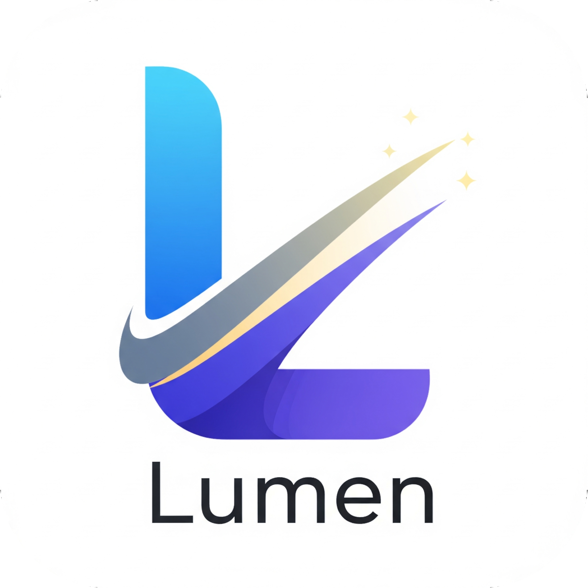

<div align="center">
  
  <h1>Lumen</h1>
  <p><strong>The control room for your live event.</strong></p>
  <p>
    <a href="https://github.com/Lumen-media/lumen/releases"><b>Download the latest release</b></a>
    &nbsp;·&nbsp; Windows &amp; Linux
  </p>
</div>

---

Running a live event means juggling half a dozen things at once: the lyrics the room is singing, the video that has to start on the right second, the slide deck, the countdown, the announcement you forgot about — and someone always has to tell you what plays next.

**Lumen puts all of it in one window.** You prepare lyrics and slides on your laptop, send them to the projector with one key, and drive the whole show from there — or from your phone.

---

## Why another presentation tool?

Most presentation software was built for someone giving a talk in a room they control. Live events are different:

- Content has to be **editable minutes before it goes on screen**, not frozen into a deck.
- The operator's screen and the **audience's screen are different screens**.
- Several people need to **talk to each other** without making noise in the room.
- The show has an **order**, and it has to keep moving.
- Everything has to work **with one hand, while you are talking**.

Lumen is built around those constraints: one operator surface, one dedicated output window, and your phone as a remote.

---

## What you can do

### Write lyrics and slides that are ready to sing

- Write in Markdown — **every blank line becomes a new slide**, so turning a song into a presentation takes seconds.
- Real rich text editing: bold, italic, underline, highlight, headings, lists, links and alignment.
- **A live thumbnail of every slide** while you type, so you always see what the room will see.
- **Backgrounds per slide or per song**: pick from the built-in gallery, search [Unsplash](https://unsplash.com) (optional — just add a free API key), or use your own images.
- Font, size and alignment per song, stored with the file.
- **Notices and announcements** with images and entrance animations — fade, slide or typewriter.

### Present to the room

- **Markdown decks** and **PowerPoint (`.pptx`)** decks — imported and rendered as real vector slides, not flattened screenshots.
- A dedicated **output window** you send to the projector: fullscreen, keyboard-driven, showing nothing else.
- A **presenter controls bar** at the bottom of the operator window showing what is currently on screen.
- Instant **blackout** (`F10`) and **wallpaper** (`F8`) when you need the screen back in a hurry.
- Slide navigation by keyboard, plus a visual sequence strip so you always know where you are.

### Play media without breaking the flow

- Audio and video playback with full transport controls, and a **MiniPlayer** pinned to the bottom so you never lose your place.
- **Drag a file from the library straight into any position in the queue** — the drop indicator shows you exactly where it will land.
- A queue that survives restarts, with shuffle, played markers and **automatic triggers** (advance a slide, start a video, fire a webhook).
- **Download videos from YouTube** into your own library and use them offline, forever.
- Live YouTube streams are detected automatically and shown as a **live badge** instead of a progress bar that never ends.

### Go live, and let the room in

- **Broadcast the current output to any browser on your local network** — share a link and anyone can follow along from their seat. Nothing to install.
- **Pair phones and tablets by QR code** and turn them into remote controls, extra screens, or a camera feed for the projector.
- Push a **phone or tablet camera straight onto the audience screen**, layered over whatever is playing.
- A dedicated **Live** screen: connected devices, transmission preview, and a per-device audio mixer next to the master volume.

### Work as a team

- **Built-in operator chat** — talk to your team and to connected devices over the same local network, without leaving the app.
- **Suggest a song from the chat** and it lands in the queue with one tap.
- Automatic notifications in the feed: *now playing…*, *added to the queue…*
- Quick reactions, unread badges and read receipts.
- **Per-device permissions** — decide exactly what each connected device is allowed to control.

### Make it yours

- **Profiles** for different services, teams or events, each with its own background and its own notes.
- **Per-profile notes** in Markdown, right beside the editor — the stuff you need to know but never show anyone.
- **Themes** for the audience screen, plus your own library of background images.
- **Folders inside the library** — organise media the way the event is organised, not the way a file browser insists.
- **Point each media type at your own folder**, or keep the whole thing portable on a USB stick and run it from any machine.
- **Six languages** out of the box — English, Portuguese and Spanish — with translations that update without reinstalling.
- A **command palette** (`Ctrl+K`) that searches lyrics, media and commands at once, and can play or queue a result instantly.
- A **keyboard shortcuts reference** built into the app (`Ctrl+Shift+K`).
- Custom titlebar and menus, system tray, and a splash screen that gets you into the app fast.

### Extend it

- **Install modules from inside the app.** The **Module Store** lives in the command palette — browse, read the docs, install, update, enable, disable, remove.
- Modules available today: **Countdown Timer**, **YouTube search**, **Bible reader**, **Raffle**.
- A module can add panels, dialogs, presenter views, overlays, settings pages, commands, menus and keyboard shortcuts — and it can read and drive Lumen's own lyrics, queue, player, library, presentation and themes.
- Module authors get a real SDK: `pnpm create @lumen/module`, hot reload during development, and a fully typed host API.

---

## How the pieces fit together

| Surface | What it is for |
|---|---|
| **Main window** | Everything: library, editor, queue, notes, chat, live controls. |
| **Output window** | What the audience sees. Sent to the projector, fullscreen, keyboard-driven. |
| **Overlay window** | Module output — a countdown, a timer — layered over the audience screen. |
| **Phones and tablets** | Remote control, extra camera feeds, chat — over your local network. |
| **Any browser on the LAN** | Follow the current slide from anywhere in the room. |

---

## Getting started

### Use the app

1. Download the installer for **Windows** or **Linux** from [Releases](https://github.com/Lumen-media/lumen/releases).
2. Drop your media into the library — Lumen creates the folder structure for you on first run.
3. Open a lyric, or import a `.pptx`, and press **F5** to send it to the output window.
4. Open **Settings → Remote Access** and scan the QR code with your phone to make it a remote control.

### Run it from source

```bash
git clone https://github.com/Lumen-media/lumen.git
cd lumen
pnpm install
pnpm tauri dev
```

You need Node.js, pnpm and a Rust toolchain. Optionally create a `.env` file with
`VITE_UNSPLASH_CLIENT_ID=<your key>` to enable Unsplash background search.

---

## Built with

| | |
|---|---|
| **Desktop shell** | Tauri 2 (Rust) |
| **Interface** | React 19, TypeScript, Tailwind CSS 4 |
| **Build** | Vite + SWC, pnpm workspaces |
| **Routing & state** | TanStack Router, TanStack Query, Zustand |
| **Editing** | TipTap, TanStack Markdown, TanStack Virtual |
| **Playback & media** | React Player; yt-dlp + FFmpeg, downloaded and managed by the app itself; Rust metadata extraction |
| **Imaging** | Rust thumbnail cache with OS-native extractors and an `lumen://` optimisation protocol |
| **Live & remote** | WebRTC, WebSocket, a built-in HTTP presentation server |
| **Storage** | SQLite, Tauri plugins (store, stronghold, window-state, notifications) |
| **Internationalization** | 6 locales, with over-the-air updates from `lumen-locales` |

---

## Extending Lumen

Modules are ordinary web apps — a manifest, a React entry point, and a typed API into the app. They run inside Lumen, share its design system, and are sandboxed by a per-panel error boundary so a bad module can't take down the show.

```bash
pnpm create @lumen/module my-module
lumen-module dev      # hot reload against a running Lumen
lumen-module build    # bundle + validate
lumen-module pack     # produce a .lumenpack
```

- Module SDK — [`Lumen-media/module-sdk`](https://github.com/Lumen-media/module-sdk)
- Host API reference — [`docs/module-api-reference.md`](docs/module-api-reference.md)
- Community catalog — [`Lumen-media/community-modules`](https://github.com/Lumen-media/community-modules)

---

## Documentation

| Guide | |
|---|---|
| Presenter guide | [`docs/presenter-usage.md`](docs/presenter-usage.md) |
| Remote access & device protocol | [`docs/websocket-access-api.md`](docs/websocket-access-api.md) |
| Chat events | [`docs/chat-websocket-events.md`](docs/chat-websocket-events.md) |
| Video downloads | [`docs/usability/video-downloader-usage.md`](docs/usability/video-downloader-usage.md) |
| Team chat | [`docs/usability/chat-usage.md`](docs/usability/chat-usage.md) |
| Architecture decisions | [`docs/architecture/`](docs/architecture/) |

---

## Roadmap

- [x] Full presentation mode with slide control
- [x] PowerPoint (`.pptx`) import and vector slide rendering
- [x] Markdown presentations with entrance animations
- [x] Custom visual themes and per-profile backgrounds
- [x] Per-profile notes
- [x] Integrated operator chat
- [x] Remote access with QR pairing and per-device permissions
- [x] Broadcast to any browser on the local network
- [x] Module system, SDK and in-app Module Store
- [x] Over-the-air translation updates
- [ ] Native mobile app (iOS/Android) as a first-class remote
- [ ] Phone/tablet as a wireless microphone
- [ ] Collaborative lyric editing across the network
- [ ] Live broadcast to the internet (RTMP)
- [ ] Backup and restore of the whole app state
- [ ] Hardware-accelerated encoding for broadcasting

---

## Contributing

Issues and pull requests are welcome. Please use the issue templates in `.github/`, and note that `feature`-labelled issues opened by non-maintainers are auto-redirected to a request — that keeps the roadmap honest and the discussion focused.

## License

No license has been declared yet. Add a `LICENSE` file before distributing binaries beyond the existing releases.
